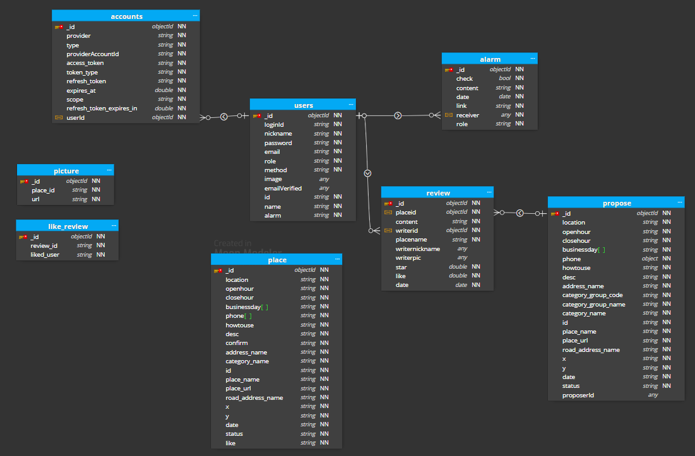
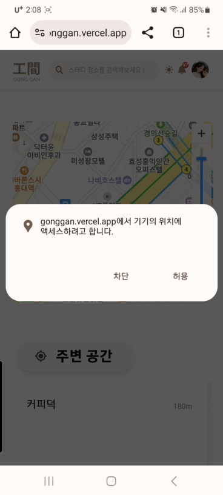
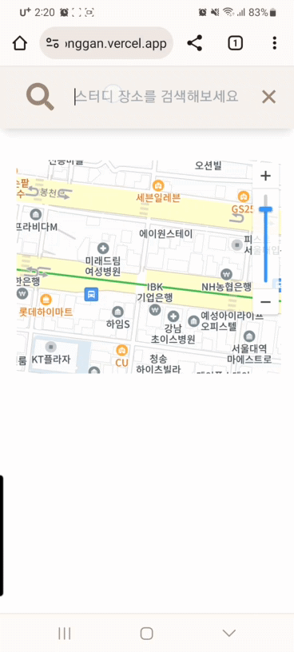

# 🏠내 주변 카공 위치 찾기 !, 工間:study
工間:study 은 사용자에게 카공 위치를 추천해주는 웹 애플리케이션입니다.<br />
사용자의 지역과 웹사이트 내에서의 활동 내역을 기반으로 하여<br />
유저들이 추천하고 제안해주신 장소를 추천해줍니다.<br />
URL :<a href="https://gonggan.vercel.app/" title="gonggan 이동!"> 工間:study</a>

## 개발동기

> 카페에서 공부를 하고싶을 때, 매번 네이버나 카카오 지도에서 공부하기 좋은 카페를 찾기가 쉽지 않은 경험이 있습니다. 이에 위치 검색만으로 공부할 수 있는 장소를 한눈에 찾을 수 있다면 새로운 장소를 탐색할 때 느끼는 피곤함을 덜 수 있지 않을까? 또, 분위기 좋은 장소를 공유하면 서로서로 좋지 않을까? 라는 생각으로 프로젝트를 기획하였습니다.


# 🧱프로젝트 구조
```
├── public # 이미지 관련 폴더
├── src 
│   ├── app # 루트폴더
│   │   ├── components # 컴포넌트 모음
│   │   │   ├── Admin # 어드민 전용 페이지 관련
│   │   │   ├── Detail # 상세페이지 관련
│   │   │   ├── FindAccount # 아이디/비밀번호 찾기 관련
│   │   │   ├── Main # 메인페이지 관련 
│   │   │   ├── MainPage # 메인페이지 하단 꾸밈 관련
│   │   │   ├── Oauth # Oauth 관련
│   │   │   └── Review # 상세페이지 리뷰 관련
│   │   ├── accountfind # 아이디/비밀번호 찾기 관련
│   │   ├── admin # 어드민 전용 페이지
│   │   ├── atom # Recoil Atoms
│   │   ├── contact # 문의 페이지
│   │   ├── hooks # 커스텀 hooks
│   │   ├── interface # DB 컬럼 Typescript 인터페이스
│   │   ├── mypage # 마이페이지
│   │   ├── oauth # Oauth
│   │   ├── places # 상세페이지
│   │   ├── police # 신고하기
│   │   ├── propose # 장소 제안하기
│   │   ├── signin # 로그인 
│   │   ├── signup # 회원가입
│   │   ├── styles # tailwind css 공통 스타일
│   │   ├── error.tsx # 공통 Error 페이지
│   │   ├── favicon.ico # 파비콘
│   │   ├── global.css # css 파일
│   │   ├── layout.tsx # 최상단 레이아웃
│   │   ├── loading.tsx # 로딩 컴포넌트
│   │   ├── not-found.tsx # 404 컴포넌트
│   │   ├── page.tsx # 최상단 root 페이지
│   │   └── providers.tsx # providers
│   ├── pages # 기존 pages방식 api
│   │   └── api # api 폴더
│   │       ├── accountFind # 아이디/비밀번호 찾기 api
│   │       ├── alarm # 알람 api
│   │       ├── auth # nextauth 및 oauth api
│   │       ├── contact # 문의하기 api
│   │       ├── duplicate # 회원가입 중복체크 api
│   │       ├── like # 좋아요 api
│   │       ├── place # 장소 api
│   │       ├── places # 상세페이지 api
│   │       ├── police # 신고 api
│   │       ├── propose # 장소 제안하기 api
│   │       ├── review # 리뷰 api
│   │       ├── session # 세션 api
│   │       ├── signup # 회원가입 api
│   │       ├── upload # cloudinary 사진 업로드 api
│   │       └── user # 유저정보 api
│   ├── type # d.ts 파일모음
│   ├── util # 유틸 함수
│   └── middleware.ts # 미들웨어
├── .env # enviroment 파일
├── .eslintrc.js # ESLint 설정
├── .eslintrc.json # ESLint 설정
├── .gitignore # Git 버전 관리에서 제외할 파일 목록을 지정하는 파일
├── next-env.d.ts # 타입스크립트 컴파일러 관련
├── next.config.js # Next.js config 세팅
├── package.json # 의존하는 패키지 리스트
├── postcss.config.js # PostCSS 구성파일
├── README.md
├── tailwind.config.ts # tailwindcss config 세팅
├── tsconfig.json # typescript 
└── yarn.lock # yarn


```

# 📜ERD


# 🔍프로젝트 프로세스


# ✅주요기능
- 위치 기반 주변공간 조회




<br />

- 장소 찾기





  
- 장소 제안하기


# 🛠️이슈

> 검색 기능을 구현하면서 동시에 검색 결과를 자동완성 창에 띄우고자 했지만, MongoDB와 Kakao API를 사용하다가 가끔씩 429 에러(사용자가 주어진 시간 동안 너무 많은 요청을 보냈음)가 발생했습니다.<br />
이 문제를 해결하기 위해 디바운스 커스텀 훅스를 개발하여, 단어 입력 후 300ms 이내에 다시 입력이 발생하면 최종 검색어를 초기화하고, 300ms 이후에 최종 검색어를 API 서버로 전송하도록 설계했습니다. 이를 통해 429 에러가 더 이상 발생하지 않았을 뿐만 아니라, 서버 부하도 감소하는 효과를 얻을 수 있었습니다.<br />
이 경험을 통해 프론트엔드 개발 뿐만 아니라 백엔드 고려를 통한 효율적인 문제 해결 능력을 강화하게 되었습니다. 항상 사용자 경험을 개선하고 서비스의 안정성을 고려하여 개발하는 데에 주력하고 있습니다.

>사용자가 사진을 업로드할 때 발생하는 로딩 시간 문제를 해결하는 데 중점을 두었습니다. 기존에는 사진 파일 자체를 데이터베이스에 직접 저장하는 방식을 사용하다보니 로딩이 매우 느렸습니다.<br />
이 문제를 해결하기 위해 클라우드 스토리지를 활용하여 업로드된 사진 파일을 먼저 저장하고, 해당 사진의 링크만을 데이터베이스에 저장하는 방식으로 변경하였습니다. 이로써 사용자가 입력한 사진을 빠르게 화면에 보여줄 수 있게 되었고, 동시에 매우 큰 용량의 사진 파일을 간단한 링크로 대체함으로써 데이터베이스의 용량을 효율적으로 활용할 수 있었습니다.<br />
이를 통해 데이터베이스에 사진 파일을 직접 저장하는 방식과 클라이언트 측에서의 base64 인코딩 활용을 경험했습니다. 또한, 제한된 자원을 최대한 활용하는 창의적인 해결책을 찾는 과정에서 더 깊이 생각하는 기회가 되었습니다. 항상 효율성과 사용자 경험을 개선하는 방향으로 개발에 전념하고 있습니다.

# 👩‍💻개발자
- 주지찬 (<a>https://github.com/jcdororo</a>)
- 정화윤 (<a>https://github.com/hwadong119</a>)
